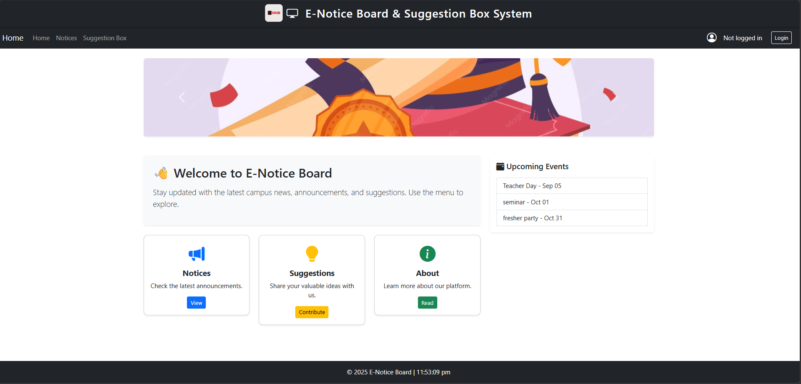
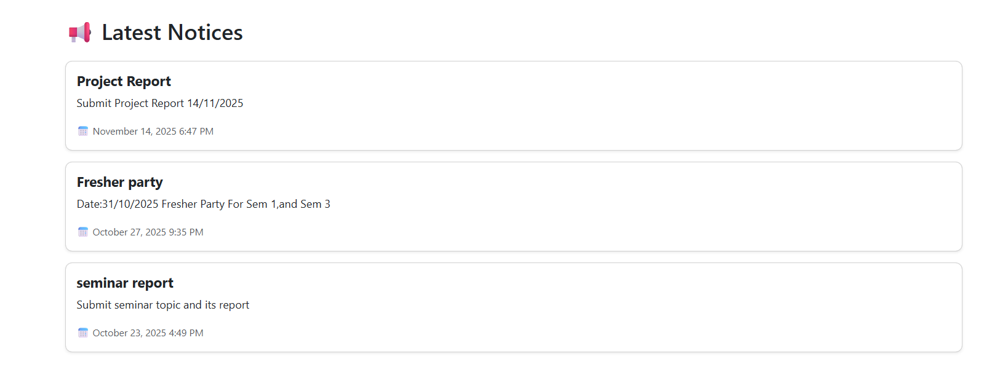
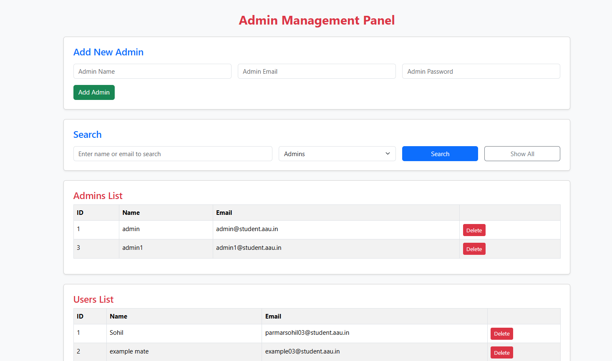

<div align="center">

# 📌 E-Notice Board and Suggestion Box Management System

<p align="center">


</p>

</div>

---

# 📖 Description

The **E-Notice Board and Suggestion Box Management System** is a web-based application developed to replace the traditional notice board with a digital platform. It enables administrators to publish notices, manage announcements, and review user suggestions, while allowing users to securely access notices and submit valuable feedback through a responsive interface.

---

# ✨ Features

### 👨‍💼 Admin Module
- Secure Admin Login
- Add New Notices
- Delete Notices
- Manage Suggestions
- View User Feedback
- Session-Based Authentication

### 👨‍🎓 User Module
- User Registration
- Secure Login
- View Latest Notices
- Submit Suggestions
- View Upcoming Events
- Logout

### 🌟 System Features
- Responsive Bootstrap Interface
- Role-Based Authentication
- CRUD Operations
- SQL Server Database
- Dynamic Notice Display
- Advertisement Carousel
- Digital Clock
- User-Friendly Interface

---

# 🛠 Tech Stack

| Category | Technologies |
|-----------|--------------|
| **Frontend** | HTML5, CSS3, Bootstrap 5, JavaScript |
| **Backend** | ASP.NET Web Forms, C# |
| **Database** | SQL Server |
| **Data Access** | ADO.NET |
| **IDE** | Visual Studio 2022 |
| **Version Control** | Git & GitHub |

---

# 📂 Project Structure

```
E-Notice-Board/
│
├── Images/
├── CSS/
├── JavaScript/
├── Screenshots/
│
├── WebForm1.aspx
├── UserLogin.aspx
├── AdminLogin.aspx
├── Register.aspx
├── Web.config
├── README.md
│
└── Database
    └── NoticeDB.sql
```

---

# ⚙ Installation

### Clone Repository

```bash
git clone https://github.com/SohilParmar018/E-Notice-Board.git
```

### Open Project

- Open **Visual Studio 2022**
- Open the solution file
- Restore NuGet packages

### Database Setup

- Open SQL Server Management Studio
- Create a database named **NoticeDB**
- Import the SQL script
- Update the connection string in **Web.config**

### Run

Press **F5** or click **Start** in Visual Studio.

---

# 🗄 Database Setup

### Database Name

```
NoticeDB
```

### Tables

- Users
- Admins
- Notices
- Suggestions
- SuggestionReplies

---
<h2>📸 Screenshots</h2>

<table>
<tr>
<td align="center">
<b>Home Page</b><br>

</td>

<td align="center">
<b>Login Page</b><br>

</td>
</tr>

<tr>
<td align="center">
<b>Notice Board</b><br>

</td>

<td align="center">
<b>Suggestion Box</b><br>

</td>
</tr>

<tr>
<td colspan="2" align="center">
<b>Admin Dashboard</b><br>

</td>
</tr>
</table>---

# 🚀 Future Enhancements

- 🔍 Search Notices
- 📂 Notice Categories
- 📧 Email Notifications
- 📱 Mobile Application
- 🔔 Push Notifications

---

# 👨‍💻 Author

### Sohil Parmar

**B.Tech Agricultural Information Technology**

📧 Email: **parmarsohil03@gmail.com**

💼 LinkedIn: https://www.linkedin.com/in/sohil-parmar018

🐙 GitHub: https://github.com/SohilParmar018

---

<div align="center">

### ⭐ If you found this project helpful, please consider giving it a Star!

</div>
